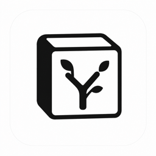

<div align="center">
  
  <h1>枝间</h1>
  <p>让想法开出花</p>
  <p>一份结构化文档，两种思考视角。</p>
</div>

---

枝间是一款面向深度思考与知识整理的 Web 应用。你可以在大纲中快速写作，也可以切换到思维导图观察结构；两种视图始终编辑同一份内容，不需要复制、转换或手动同步。

> 大纲适合输入，导图适合看见关系。枝间让两者成为同一份文档的不同视角。

## 功能亮点

### 大纲与导图，实时同步

- 在大纲中增删、缩进、拖动节点，导图结构同步更新。
- 在导图中编辑、移动或新增节点，大纲内容同步变化。
- 标题、正文、待办、引用、图片和表格在两个视图中保持一致。
- 支持展开/收起、专注节点、面包屑返回和文档内查找替换。

### 不止一种导图

枝间内置多种结构，用同一份内容切换不同观察方式：

| 结构 | 适合场景 |
| --- | --- |
| 思维导图 | 从中心主题向两侧发散 |
| 逻辑图 | 按单一方向梳理推导关系 |
| 组织架构图 | 展示层级、组织和分类关系 |
| 时间轴 | 按横向或纵向顺序组织内容 |
| 树形图 | 从上向下展开结构 |

导图支持主题切换、背景色、节点框样式和连接线样式。主题只改变视觉表达，不改变文档内容；每篇文档会记住所选结构、方向和主题。

### 为整理而设计的编辑体验

- 使用拖拽调整节点顺序和层级。
- 使用待办、标题、加粗、斜体、颜色等格式表达重点。
- 导图支持多选节点，并复用统一工具栏批量设置格式或待办状态。
- 支持图片查看、表格编辑、引用和挖空内容。
- 专注任意节点后，可继续向下专注，并通过顶部面包屑快速返回。

### 工作区与搜索

- 使用文件夹组织文档，支持新建、重命名、移动、复制和删除。
- 浏览器记住最近打开的文档以及文件夹展开状态。
- 全局搜索定位文档和节点；进入结果后仍显示完整上下文。
- 回收站支持多选、恢复、彻底删除和清空。
- 自动保存只在失败或冲突时打扰用户，多标签页或多设备冲突不会静默覆盖内容。

### 导入、导出与分享

**导入**

- 支持单个或批量导入 Markdown，每个文件可创建为独立文档。
- 兼容标准 Markdown 图片及幕布导出的嵌套链接图片格式。
- 外链图片会尽量保存到枝间自己的私有存储；单张图片失败不影响正文导入。

**导出**

- 通用：Markdown。
- 大纲：图片、PDF、Word、HTML。
- 导图：图片、PDF，并保留当前画布主题背景。

**分享**

- 通过链接或二维码发布只读文档。
- 访客仍可切换大纲/导图、搜索、展开收起和导出。
- 登录用户可以将分享文档保存到自己的工作区，图片会一并复制。

## 快速开始

1. 注册或登录枝间。
2. 在“我的文档”中新建文档或文件夹。
3. 使用大纲输入内容，通过缩进建立层级。
4. 切换到导图，选择合适的结构与主题。
5. 需要沉浸梳理时专注某个节点；完成后导出或开启分享。

常规编辑会自动保存。标题栏不显示“保存中”或“已保存”，只有保存失败或发生版本冲突时才出现处理入口。

---

## 面向开发者

### 核心原则

`ZhiJianTree` 是文档唯一数据源。

```text
                  ┌─ BlockNote ─ 大纲视图
ZhiJianTree ─ TreeStore
                  └─ MindElixir ─ 导图视图
```

BlockNote 和 MindElixir 都只是视图层。它们通过 adapter 和 `TreeStore` command 读取、修改同一棵树，不各自持久化业务数据。新增编辑能力时，应先确认它如何落到 `ZhiJianTree`，而不是在某个编辑器内部维护第二份状态。

### 技术栈

| 层级 | 技术 |
| --- | --- |
| 应用 | React 19、TypeScript、Vite |
| 大纲 | BlockNote 0.54 |
| 导图 | MindElixir 5.15 |
| 数据与认证 | Supabase Postgres、Auth、Storage |
| API 与部署 | Vercel Functions、Vercel |
| 单元测试 | Vitest、Testing Library |
| 端到端测试 | Playwright |

### 项目结构

```text
src/
├── core/          # ZhiJianTree、TreeStore、Markdown 与导出模型
├── outline/       # BlockNote adapter 与大纲交互
├── mindmap/       # MindElixir adapter、布局、主题与导图交互
├── shared/        # 通用工具栏、图片缓存、Toast、快捷键等
├── workspace/     # 工作区、认证、文件树与服务端 API 客户端
└── share/         # 只读分享页入口
api/               # Vercel Functions
supabase/migrations/
e2e/               # Playwright 测试
```

### 数据存储

数据均按 Supabase Auth 的 `user.id` 归属，email 只作为用户资料，不参与数据主键或权限判断。

| 数据表 | 职责 |
| --- | --- |
| `workspace_states` | 用户资料、文件夹/文件导航树、回收站和工作区偏好 |
| `workspace_documents` | 每个 `user_id + file_id` 一行，保存文档树、schema version、revision 和更新时间 |
| `workspace_assets` | 图片的稳定 asset ID、Storage 路径和文件元数据 |
| `workspace_document_shares` | 分享 token、所有者、文件 ID 和启用状态 |

文档使用 optimistic concurrency 保存。客户端提交当前 `revision`，服务端只更新 revision 匹配的记录；不匹配时返回 HTTP 409，避免多标签页或多设备相互覆盖。持久化文档包含 `schemaVersion`，为后续数据结构升级保留迁移入口。

### 图片策略

```text
文档 tree 保存 assetId / storagePath
                ↓
私有 Supabase Storage：workspace-images
                ↓
服务端签发短期访问 URL
                ↓
浏览器 IndexedDB 缓存 Blob
```

- Supabase Storage 是图片的持久化来源，IndexedDB 只作为本地缓存。
- 换设备、刷新页面、打开分享文档或保存分享文档后，图片仍可恢复。
- 分享接口只为当前分享文档实际引用的图片签发 URL。
- “清理无用图片”会删除超过 24 小时且未被任何文档引用的资源；这个安全窗口避免图片上传后、文档自动保存前被误删。

### Auth 与安全

- 登录、注册、token 刷新以及邮箱/密码修改均通过 Supabase Auth。
- 数据表启用 RLS，并撤销客户端对工作区业务表的直接访问。
- Vercel API 使用 service role 完成受控读写。
- `SUPABASE_SERVICE_ROLE_KEY` 只能存在于服务端环境，绝不能使用 `VITE_*` 前缀。
- 分享页只读，分享 token 仅能访问启用状态下的指定文档及其引用资源。

## 本地开发

### 环境要求

- Node.js 22
- npm
- 一个 Supabase 项目

### 配置环境变量

复制 `.env.example` 为 `.env.local`，填写：

```bash
SUPABASE_URL=https://<project-ref>.supabase.co
SUPABASE_PUBLISHABLE_KEY=sb_publishable_...
SUPABASE_SERVICE_ROLE_KEY=sb_secret_...

VITE_SUPABASE_URL=https://<project-ref>.supabase.co
VITE_SUPABASE_PUBLISHABLE_KEY=sb_publishable_...
```

兼容旧项目时可使用 `SUPABASE_ANON_KEY` 代替 publishable key。服务端密钥不要提交到仓库。

### 安装与启动

```bash
npm ci
npm run dev
```

数据库结构位于 [`supabase/migrations`](./supabase/migrations)。新环境需要先应用 migrations，再启动应用。

开发环境中的 `/api/*` 由 [`vite.config.ts`](./vite.config.ts) 提供：认证仍连接真实 Supabase Auth，工作区数据、文档 revision 和图片字节按 `user.id` 写入本地 `.zhijian-server-data/`。接口契约与线上一致，包括 409 冲突、图片上传和账号修改。该目录仅用于本地开发，可以随时删除。

## 质量检查

```bash
npm test
npm run lint
npm run build
npx playwright install chromium
npm run test:e2e
```

GitHub Actions 会在 push 到 `main` 以及 pull request 时，使用 Node.js 22 执行安装、单元测试、lint、生产构建和 Playwright E2E。

## 部署

项目部署在 Vercel，服务区域固定为 Singapore (`sin1`)。关联 GitHub 仓库后：

- 推送 `main` 触发 Production 部署。
- 其他分支和 pull request 生成 Preview 部署。
- Vite 生成的 `/assets/*` 内容哈希资源使用长期 immutable 缓存，HTML 保持重新验证。

部署前请确认：

1. Supabase migrations 已全部应用。
2. Production 与 Preview 环境变量均已配置。
3. `workspace-images` 保持 private。
4. CI 检查全部通过。

---

枝间的设计目标很明确：让结构化写作与可视化思考共享同一份可靠数据，并让工具退到内容之后。
