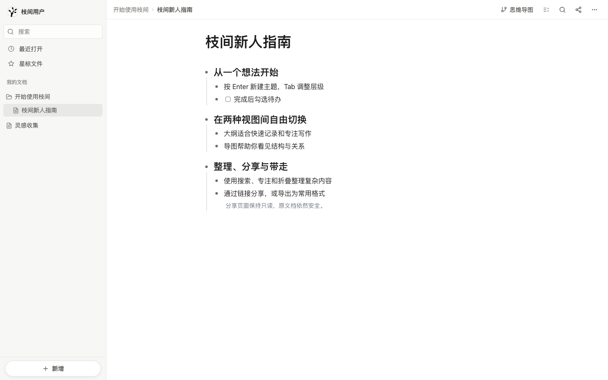
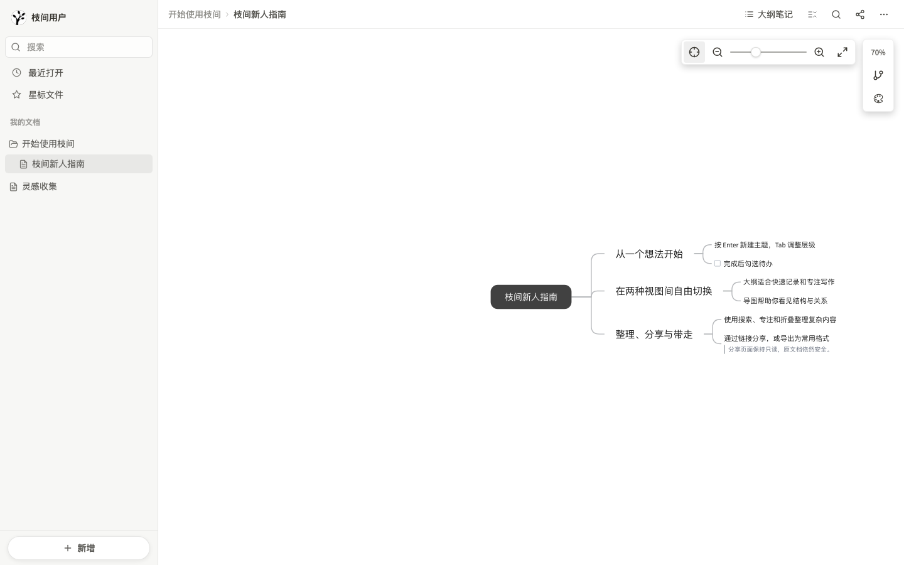
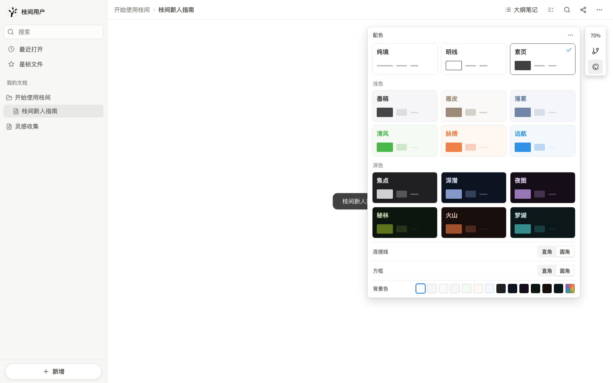
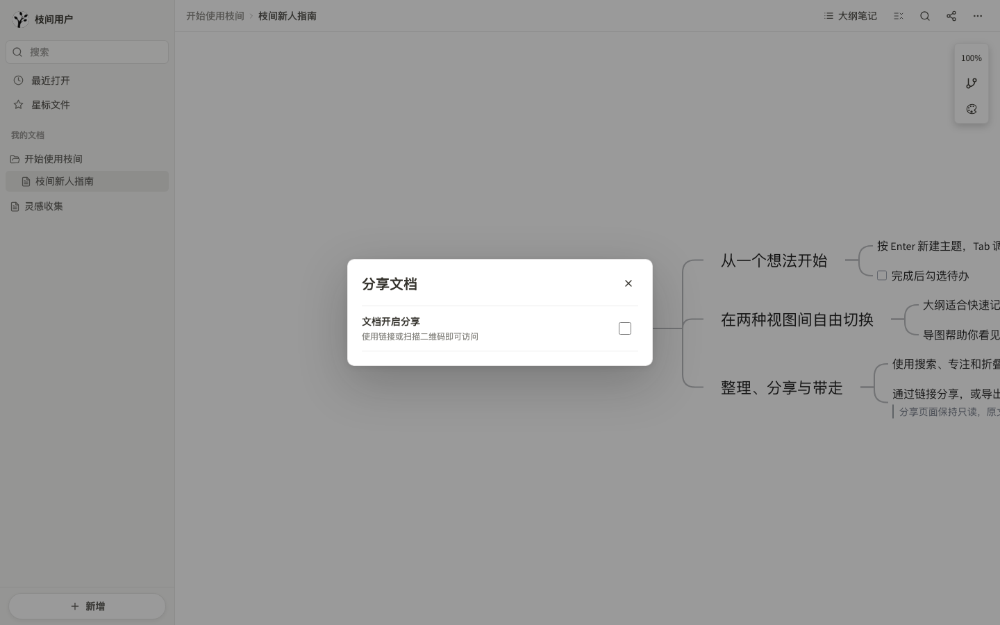

  
  <h1>枝间新人指引</h1>
  
从记录第一个想法，到整理并分享一张完整导图。

---

## 先认识枝间

枝间用一棵结构化的树保存文档。你看到的“大纲笔记”和“思维导图”不是两份文件，而是同一份内容的两种视图：

- **大纲笔记**适合快速输入、修改文字和调整层级。
- **思维导图**适合观察结构、梳理关系和整体展示。

在任一视图中修改内容，另一个视图都会同步更新。

> 推荐工作流：先用大纲快速记录，再切换到导图检查结构，最后通过专注、搜索和折叠完成整理。

## 1. 创建并管理文档

登录后，左侧是“我的文档”，右侧是当前文档内容。

### 新建文档或文件夹

1. 点击侧边栏底部的 **新增**。
2. 选择 **新增文档** 或 **新增文件夹**。
3. 名称会自动进入选中状态，直接输入标题并按 `Enter` 即可。

文件夹可继续创建子文件夹或文档。拖动侧边栏中的项目，可以调整顺序或移动到其他文件夹。

### 常用管理操作

将鼠标移到文档或文件夹上，点击右侧 **更多**，可进行：

- 重命名
- 移动
- 添加或取消星标
- 创建副本
- 拷贝链接
- 在新窗口打开
- 删除

删除的内容会先进入 **回收站**。点击左上角头像，在用户菜单中打开回收站，可以多选恢复、彻底删除或清空回收站。

### 快速找到文档

- **最近打开**：查看近期使用的文档。
- **星标文件**：固定常用文档。
- **搜索**：搜索文件夹、文档标题以及文档内的节点文字。
- 搜索结果进入文档后，大纲会短暂高亮对应节点，导图会自动聚焦对应节点。

## 2. 用大纲快速记录

大纲中的每一行都是一个主题。缩进关系决定父子层级，也会直接成为导图结构。

### 输入与调整层级

| 操作 | 结果 |
| --- | --- |
| `Enter` | 新增同级主题 |
| `Tab` | 将当前主题降为上一个主题的子级 |
| `Shift + Tab` | 将当前主题提升一级 |
| `↑` / `↓` | 在上下主题间移动光标 |
| `Shift + ↑` / `Shift + ↓` | 向上或向下扩展选择 |

将鼠标移到一行左侧，可以拖动整行调整位置。点击主题前的展开控件，可以收起或展开其下级内容。

### 设置整行内容

点击一行左侧的圆形 **更多** 按钮，可针对整行设置：

- 正文、一级标题、二级标题、三级标题
- 加粗、斜体、下划线、删除线
- 字体颜色与荧光笔
- 编辑引用
- 添加图片、待办、表情符号或表格
- 删除整行

选中文字后出现的工具栏只修改选中的文字；行级菜单则作用于整个主题。

### 使用斜杠菜单

在空行中输入 `/`，可快速插入当前支持的内容类型。菜单靠近页面底部时会自动显示在光标上方。

> 单击文字末尾空白处，光标会落到该行末尾；从空白处按住向左拖动，仍可正常选择文字。

## 3. 切换到思维导图

点击顶部的 **思维导图**，同一份文档会立即以导图方式展示。

### 节点的基本交互

- **单击未选中节点**：选中节点并显示工具栏。
- **再次单击已选中节点**：进入文字编辑。
- **按住节点并拖动**：移动节点；拖动结束后不会误入编辑。
- **选中节点旁的加号**：快速添加下级节点。
- **点击待办框**：切换完成状态。
- **点击展开控件**：收起或展开下级节点。
- **点击空白处**：取消当前选择或关闭菜单。

在空白画布上拖动可以移动视野。右上角缩放工具支持居中、缩小、滑杆缩放、放大和全屏显示；点击百分比可恢复 `100%`。

### 多选与批量格式

按住 `Shift` 点击多个节点，或在空白画布上框选节点。多选后仍使用原有格式工具栏，可以批量设置：

- 待办状态
- 加粗、斜体、下划线、删除线
- 字体颜色
- 背景颜色

## 4. 选择导图结构与主题

导图右上角有 **布局** 和 **样式** 两个入口。鼠标移入即可打开对应面板。

### 布局

枝间提供五种导图结构：

- **思维导图**：左右展开，可选择先左后右、先右后左或左右交叉。
- **逻辑图**：向左或向右推导。
- **组织架构图**：向上或向下展示层级。
- **时间轴**：向右或向下排列过程。
- **树形图**：向下延伸，并选择左分支或右分支。

切换布局后，导图会自动定位到根节点。每篇文档都会记住所选布局，下次打开继续使用。

### 主题与样式

点击主题卡片即可立即应用。主题面板还可以设置：

- 连接线使用直角或圆角
- 节点框使用较小圆角或圆角
- 自定义画布背景色

主题只改变背景、文字、边框和连接线等视觉样式，不会修改节点内容、层级或位置。通过面板右上角 **更多** 可以将当前布局或主题设为以后新建文档的默认值。

## 5. 专注一个主题

当文档层级较深时，可以把任意节点临时作为当前文档标题：

1. 在大纲中点击节点前的圆点，或在导图节点菜单中选择 **专注此节点**。
2. 当前节点会升格为标题，只显示它和下级内容。
3. 继续选择下级节点，可以逐层向下专注。
4. 点击顶部面包屑可返回任意上级，或选择 **取消专注** 回到完整文档。

专注只改变当前查看范围，不会剪切、移动或复制节点。大纲与导图切换后仍保持同一专注路径。

## 6. 查找、替换与折叠

### 文档内查找

点击顶部放大镜打开 **查找替换**：

- 输入关键词查看匹配数量。
- 使用上一个/下一个结果快速定位。
- 大纲定位并高亮节点；导图定位并聚焦节点。
- 在编辑模式下可替换当前结果或全部替换。

### 批量展开与折叠

点击顶部 **展开/折叠主题**，可以控制：

- 全部主题
- 一级主题
- 二级主题
- 三级主题

折叠状态保存在文档中，适合隐藏暂时不需要关注的细节。

## 7. 导入与导出

### 导入 Markdown

点击左上角头像，在用户菜单中选择 **导入文档**：

- 选择一个或多个 Markdown 文件：每个文件都会创建为一篇独立文档。
- 导入会尽量保留标题层级、文字格式和图片。
- 外链图片会尝试保存到枝间自己的图片存储；个别图片失败不会中断正文导入。

如果需要用 Markdown 替换当前文档，请点击顶部 **更多 → 导入** 并只选择一个文件。系统会在替换前再次确认，替换后仍可立即撤销；同时选择多个文件时仍会分别创建新文档。

### 导出文档

点击顶部 **更多 → 导出**。菜单会根据当前视图显示可用格式：

| 当前视图 | 可导出格式 |
| --- | --- |
| 大纲笔记 | Markdown、图片、PDF、Word、HTML |
| 思维导图 | Markdown、图片、PDF |

导图图片与 PDF 会保留当前主题的画布背景。

## 8. 分享只读文档

点击顶部 **分享** 打开分享面板。

1. 打开 **文档开启分享** 开关。
2. 点击 **复制链接**，或让访问者扫描二维码。
3. 关闭开关后，原分享链接立即停止访问。

分享出去的文档是只读的。访问者可以切换大纲与导图、搜索、展开折叠和导出，但不能编辑文字、移动节点、勾选待办或打开节点编辑工具栏。

已登录的访问者可以点击 **保存到我的枝间**，创建一份独立副本；原文档不会被修改。

## 9. 自动保存与安全提示

- 停止编辑约 2 秒后，枝间会自动保存最新内容。
- 正常保存时不显示提示，避免干扰写作。
- 切换文档或离开编辑器时，有待保存内容会立即补存。
- 标题栏出现 **保存失败** 时，可点击 **重试**。
- 出现 **存在保存冲突** 时，说明其他标签页或设备更新了同一文档，请按提示选择保留版本。

图片原文件保存在枝间的私有云存储中。本地浏览器会缓存图片以加快再次打开速度，但换设备或清理缓存后仍可从服务器恢复。

## 10. 常用快捷键

以下快捷键中的 `Ctrl`，在 macOS 上通常对应 `Command`。

| 功能 | 快捷键 |
| --- | --- |
| 撤销 / 重做 | `Ctrl + Z` / `Ctrl + Shift + Z` |
| 加粗 / 斜体 / 下划线 | `Ctrl + B` / `Ctrl + I` / `Ctrl + U` |
| 全局搜索 | `Ctrl + Shift + F` |
| 切换大纲与导图 | `Ctrl + Alt + Shift + M` |
| 添加图片 | `Alt + Enter` |
| 添加或删除待办 | `Ctrl + Shift + L` |
| 创建节点副本 | `Ctrl + D` |
| 进入当前主题 | `Ctrl + ]` |
| 返回上一级主题 | `Ctrl + [` |
| 打开快捷键列表 | `Ctrl + /` |

更多快捷键可在顶部 **更多 → 快捷键列表** 中查看。

---

## 一套顺手的使用方法

1. **先写完**：在大纲中用 `Enter` 和 `Tab` 快速记录，不急着调整样式。
2. **再看结构**：切换到导图，检查层级是否清楚、主题是否需要移动。
3. **缩小范围**：专注当前正在处理的分支，完成后沿面包屑返回。
4. **隐藏细节**：折叠已完成或暂时不相关的主题。
5. **交付结果**：按使用场景选择分享链接、图片、PDF、Word 或 Markdown。

枝间不会要求你在“大纲”和“导图”之间选择。用适合当下思考阶段的视图即可，内容始终是同一份。
